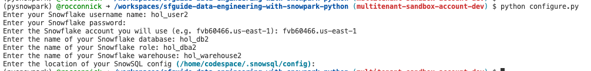

## SNOWFLAKE PREREQUISITES
**You will be provisioned a Snowflake account with sufficient permissions to run this lab.**
The account will have a few things already set up for you:
* Frostbyte Weathersource data from Snowflake Marketplace
* Acceptance of terms for Snowflake Anaconda channel

For that account, you will receive credentials and parameters that look like the table below. *Note: these are just examples, not the actual values you will use.*

Parameters | Value
------------|--------------
Account | fvb60466.us-east-1
User | hol_user2
Password | ****
Role | hol_dba2
Warehouse | hol_warehouse2
Database | hol_db2

## GITHUB PREREQUISITES

### Fork and Clone Repository for Quickstart
You’ll need to create a fork of the repository for this lab in your GitHub account, which if you are reading this file you've likely already done that. However, you can check for updates to the repository and lab by visiting phData’s
[Data Engineering Pipelines with Snowpark Python](https://github.com/phdata/sfguide-data-engineering-with-snowpark-python/) associated GitHub Repository and click on the Fork
button near the top right. Complete any required fields and click Create Fork.


By default GitHub Actions disables any workflows (or CI/CD pipelines) defined in the forked repository.
This repository contains a workflow to deploy your Snowpark Python UDF and stored procedures, which
we’ll use later on. So for now enable this workflow by opening your forked repository in GitHub, clicking on
the Actions tab near the top middle of the page, and then clicking on the I understand my workflows, go
ahead and enable them green button.

### GitHub Actions

In order for your GitHub Actions workflow to be able to connect to your Snowflake account you will need to store your Snowflake credentials in GitHub. Action Secrets in GitHub are used to securely store values/variables which will be used in your CI/CD pipelines. In this step, we will create secrets for each of the parameters.

- From the repository, click on the Settings tab near the top of the page. From the Settings page, click on the "Secrets and variables" then "Actions" tab in the left-hand navigation. The Actions secrets should be selected. For each secret listed below click on "New repository secret" near the top right and enter the name given below along with the appropriate value (adjusting as appropriate).

    Secret Name | Secret Value
    ------------|--------------
    SNOWSQL_ACCOUNT | \<myaccount\>
    SNOWSQL_USER | \<myusername\>
    SNOWSQL_PWD | \<mypassword\>
    SNOWSQL_ROLE | \<myrole\>
    SNOWSQL_WAREHOUSE | \<mywarehouse\>
    SNOWSQL_DATABASE | \<mydatabase\>

- Notes:
    - To get the SNOWSQL_ACCOUNT, in the Snowflake console click on your account name in the lower left, hover over your account, then select Copy account URL.

    

    - The account is **identifier.region.cloudprovider** prior to **.snowflakecomputing.com** 

    

### Create a GitHub Codespace

Note: This development can be done on your desktop with VS Code, however Codespaces greatly simplifies the prerequisites and complexities of local development.


- If you’ve already created a Codespace, it can be launched and stopped from this window as well.

    

- Once the Codespace is launched, you will need to install python and Snowflake extensions

    

- Python extension installed. Search for and install the “Python” extension (from Microsoft) in the
Extensions pane in the Codespace.
- Snowflake extension installed. Search for and install the “Snowflake” extension (from Snowflake) in the
Extensions pane in the Codespace.
   - Select the Snowflake icon in the left pane of the Codespace to sign into snowflake extension using
your snowflake URL then enter your username and password.
        -  Note: to get the snowflake URL, just as you did for the GitHub secret step; in the Snowflake console click
on your account name in the lower left, hover over your account, then select Copy account URL.
- Once you are signed into the Snowflake extension, open a new terminal

    


### Create Anaconda Environment
This lab will take place inside an Anaconda virtual environment running in the Codespace. You will create and activate an Anaconda environment for this lab using the supplied conda_env.yml file. Run these commands from a terminal in the root of your local forked repository.
```
conda env create -f conda_env.yml
conda init bash
```
You will need to close and reopen the terminal, then execute:
```
conda activate pysnowpark
```
Once activated you should see `(pysnowpark)` in front of the host name
 
 

### Configure credentials in configuration files

Snowflake credentials for the lab are configured by the `configure.py` script.  


The script will write a few files:
```
# SnowSQL config (used by VSCode Snowflake Extension and Python scripts)
/home/codespace/.snowsql/config

# Snow CLI config for step 5
./steps/05_fahrenheit_to_celsius_udf/app.toml 

# Snow CLI config for step 6
./steps/06_orders_update_sp/app.toml

# Snow CLI config for step 7
./steps/07_daily_city_metrics_update_sp/app.toml
```

Run the script by opening a terminal in VSCode and running the following command:
```
python configure.py
```

Enter the credentials/parameters provided by your lab facilitator as you are prompted in the terminal.  It should look something like this:
 
 


### Test connection
Lastly, lets test that the connection is successful. To do this we'll run `test_connection.py`

```
python test_connection.py
```

If the connection test returns successful, you have completed all the prerequisites for the lab. If it returns an error message, reopen the credentials file that you created at the [Create Snowflake Credentials File](#create-snowflake-credentials-file) step and check the account is correctly formatted and the username and password are correct.

If you have successfully completed all the steps, congratulations you are ready for the Hands on Lab! If you completed these prerequisites prior to attending the Hands on Lab, you can stop the Codespace in Github where you launched it from, or it will automatically stop after 30 mintues